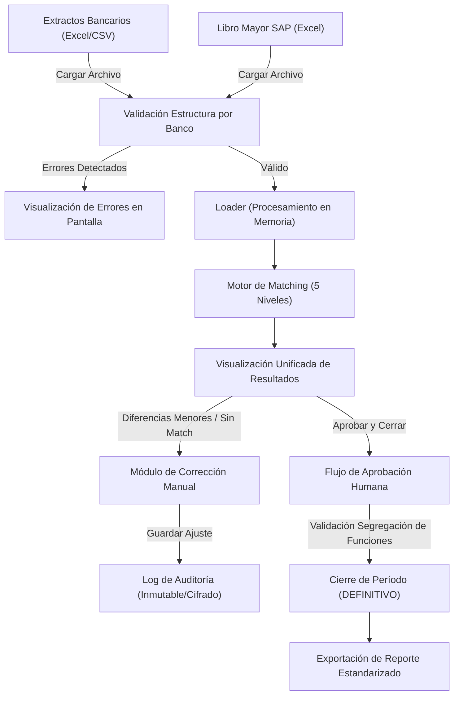
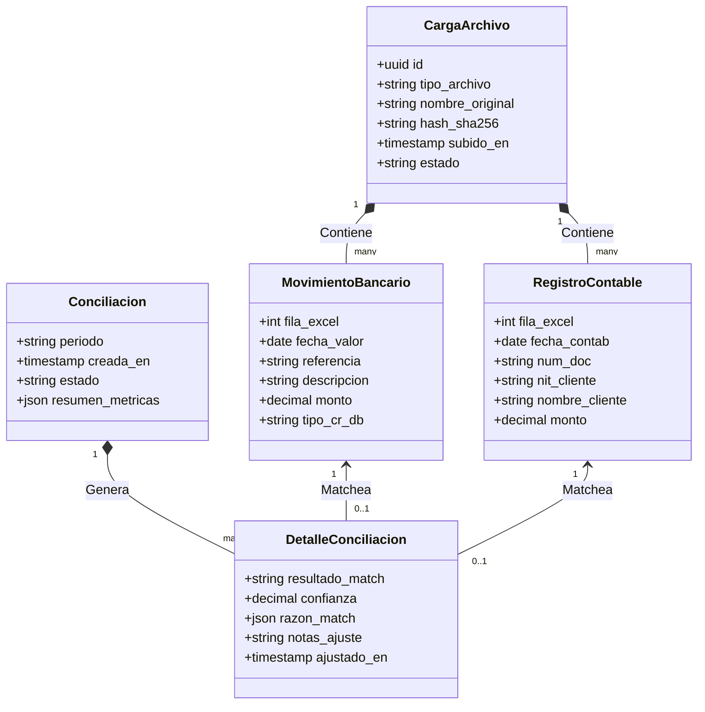

# Propuesta de Solución: Automatización del Proceso de Conciliación Bancaria vs SAP
**Cliente:** Área Financiera — Tesorería
**Fecha:** 28 de Mayo de 2026
**Propuesto por:** Equipo de Desarrollo de Software

---

## 1. Introducción y Contexto

El equipo de Tesorería realiza actualmente la conciliación bancaria de forma **100% manual**, procesando extractos de 3 bancos (Bancolombia, Davivienda y Banco Bogotá) y cruzándolos visualmente con los reportes contables de SAP. Este proceso consume un tiempo operativo considerable y presenta un riesgo inherente de error humano debido a la magnitud de los datos y la falta de estandarización.

Esta propuesta define el **alcance, arquitectura y entregables del MVP (Producto Mínimo Viable)** y su evolución a la **Fase 2**, con el fin de transformar este flujo en un proceso automatizado, seguro y auditable, reduciendo la periodicidad de mensual a períodos más cortos y flexibles de ejecución.

---

## 2. Flujo del Sistema (Estado Deseado)

El siguiente diagrama ilustra el flujo propuesto desde la carga de archivos hasta la aprobación final y el archivo inmutable del período:

---

## 3. Propuesta de Alcance y Compromisos

Hemos estructurado el proyecto en etapas bien delimitadas para garantizar un desarrollo ágil y entregas de valor tempranas.

### 📋 Módulos del MVP (Alcance Comprometido)

1.  **Carga y Validación Dinámica de Archivos:**
    *   Soporte nativo para los formatos reales de **Bancolombia** (sin encabezado, parseo posicional), **Davivienda** (encabezados específicos), **Banco de Bogotá** (formato de fecha y montos débito/crédito separados) y **Libro Mayor SAP** (multi-hoja por banco).
    *   Validaciones estructurales específicas para cada origen en lugar de una plantilla rígida.
    *   Prevención de duplicados de carga mediante hashes SHA-256.
2.  **Motor de Matching Inteligente:**
    *   Ejecución en memoria (sin persistencia de archivos crudos en disco para máxima seguridad).
    *   Nivelación de coincidencias en 5 pasos:
        *   **EXACTO:** Mismo NIT/referencia, monto idéntico y fecha ±1 día.
        *   **ALTO:** Mismo NIT/referencia, monto idéntico y fecha ±3 días.
        *   **MEDIO:** Monto idéntico y fecha ±5 días (sin referencia, útil para Bancolombia).
        *   **TOLERANCIA:** Diferencia de monto de hasta **$2.000 COP** (o el valor parametrizado) y fecha ±5 días.
        *   **BAJO:** Coincidencia difusa por descripción bancaria (fuzzy matching usando Jaccard con umbral >0.75).
3.  **Limpieza Inteligente de Anulados:**
    *   Detección y descarte automático de parejas de transacciones anuladas en SAP (original + reversión) basadas en el número de documento y comentarios ("anulado", "Anular entrada..."), evitando falsos positivos de coincidencia.
4.  **Módulo de Aprobación y Corrección Manual:**
    *   Interfaz React para forzar asociaciones, ignorar movimientos (cargos por comisiones o GMF) y dividir pagos.
    *   Registro obligatorio del **motivo del ajuste** en el backend.
    *   **Segregación de Funciones:** El sistema bloquea técnicamente la aprobación del período si el aprobador fue el mismo analista que realizó los ajustes manuales.
5.  **Flexibilidad de Períodos:**
    *   Diseño de la base de datos y la UI adaptados para procesar cierres de períodos configurables, permitiendo múltiples cargas sin conflictos de integridad de datos.
6.  **Seguridad y Auditoría:**
    *   Logs de auditoría inmutables (append-only) que rastrean quién, cuándo y qué se modificó.
    *   Expiración automática de sesión y enmascaramiento de NITs/PII de clientes en la interfaz.

### 🚀 Alcance de Fase 2 (Futuro)

*   **Integración Directa con SAP:** Conexión vía API/RFC para eliminar la descarga e importación manual del archivo de Libro Mayor SAP.
*   **Gestión y Seguimiento de Pendientes:** Mapeo de pendientes históricos para arrastrar saldos no conciliados entre períodos.
*   **Dashboard de Métricas y Analítica:** Gráficos históricos de eficiencia del motor, volumen de operaciones y evolución de saldos.

---

## 4. Arquitectura de Datos y Motor de Matching

El siguiente diagrama detalla cómo se cruzan las fuentes de datos y cómo el motor clasifica y almacena los resultados en base de datos:

---

## 5. Cronograma de Implementación Comprometido

Proponemos un plan de desarrollo de **3 Fases** con entregables funcionales claros:

### 📅 Fase 1: Carga y Procesamiento Base
*   **Entregables:**
    *   Loader de extractos (Davivienda, Bancolombia, Banco Bogotá) y SAP con validación específica de columnas en el backend.
    *   Estructura de base de datos Django adaptada a períodos específicos.
*   **Prueba de Aceptación:** Cargar exitosamente los Excels de muestra reales y verificar la correcta normalización en base de datos.

### 📅 Fase 2: Motor de Matching y Lógica Contable
*   **Entregables:**
    *   Algoritmo de matching implementado en memoria con los 5 niveles (incluyendo tolerancia de monto y fuzzy matching de descripciones).
    *   Lógica de preprocesamiento de anulados de SAP.
    *   API REST de consulta de resultados y detalles de coincidencia.
*   **Prueba de Aceptación:** Ejecutar el matching automático sobre los datos de muestra reales y obtener una tasa de coincidencia exacta/alta >70% sin intervención humana.

### 📅 Fase 3: Visualización e Interfaz de Aprobación
*   **Entregables:**
    *   Páginas React de Carga de Archivos, Tabla de Resultados con badges de colores y panel lateral de justificación del match ("¿Por qué coincidió?").
    *   Pantalla de Aprobación final y módulo de ajustes manuales con motivo obligatorio y validación de segregación de roles.
*   **Prueba de Aceptación:** Flujo de extremo a extremo completado por un usuario: cargar archivos, resolver un ajuste manual (con justificación) y aprobar el período ingresando credenciales de supervisor.

---

## 6. Métricas de Éxito del Proyecto

Al finalizar la implementación del MVP, el éxito del sistema se medirá bajo los siguientes indicadores:

| Métrica | Estado Actual (As-Is) | Estado Deseado (To-Be) | Objetivo |
|---|---|---|---|
| **Frecuencia del Proceso** | Mensual | Periódica / Flexible | Sostenible en períodos cortos |
| **Tiempo de Conciliación** | 100% manual (días de trabajo) | Automatizado + Aprobación (< 1 hora) | **Reducción > 90%** en tiempo operativo |
| **Trazabilidad** | Ninguna (cálculos en Excel local) | Logs inmutables y snapshots en Base de Datos | **100% de transacciones** auditadas con autor, fecha e IP |
| **Errores Humanos** | Riesgo alto (validación visual de montos) | Validación cruzada por software + tolerancia parametrizada | **Minimización completa** de errores de digitación o match falso |
